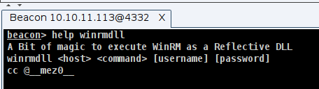
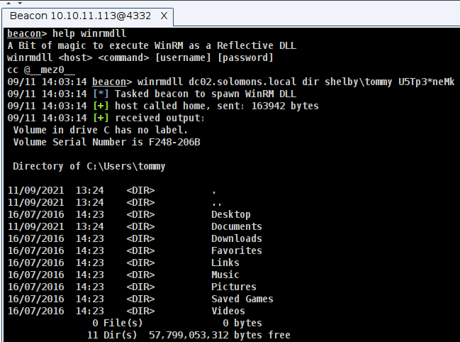
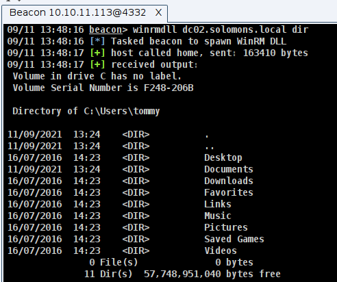

# WinRMDLL

A while ago I produced [CSharpWinRM](https://github.com/mez-0/CSharpWinRM) which was alright, but I wanted to look at the [WinRM C++ API](https://docs.microsoft.com/en-us/windows/win32/winrm/winrm-c---api) properly. 

The project comes with an [Aggressor Script](dist/winrmdll.cna) for easy use:

**<u>Using credentials</u>**:

**<u>Without credentials</u>**:

Don't do what I did and put the command at the end and spend an hour being confused as to why the username was now `whoami`...

